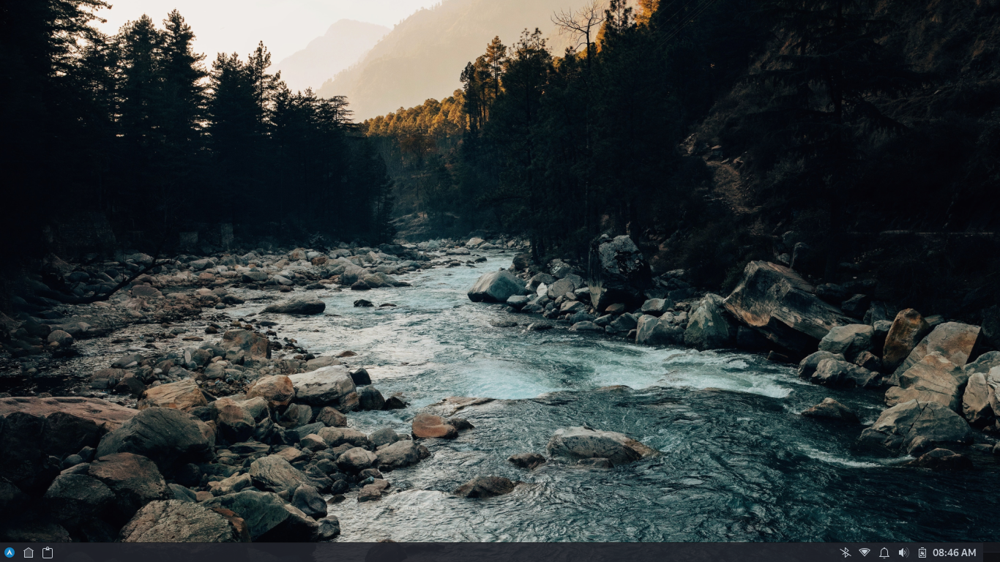
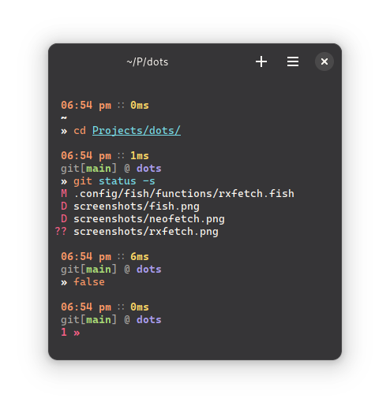
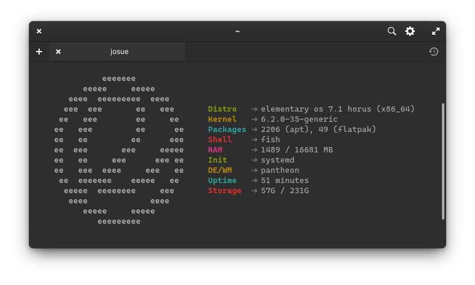
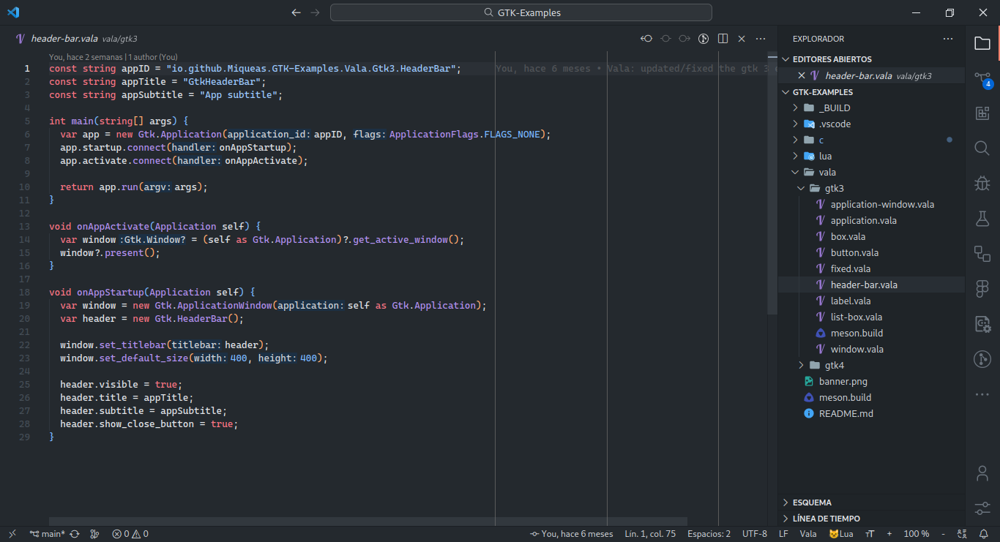

  <h1>dots</h1>
  <h3>Welcome to my dotfiles repository</h3>

System details:

  * __Distro__: Arch
  * __DE__: GNOME
  * __WM__: Mutter (package [mutter-performane](https://aur.archlinux.org/packages/mutter-performance))
  * __Theme__: Adwaita
  * __Icons__: None
  * __Font__: Cantarell (default size)
  * __Monospace Font__: [Caskaydia Cove Nerd Font](https://archlinux.org/packages/community/any/otf-cascadia-code-nerd/) (10pt)
  * __Terminal__: [Black Box](https://flathub.org/apps/details/com.raggesilver.BlackBox)
  * __Terminal Theme__: [Monokai Pro](https://github.com/Gogh-Co/Gogh/blob/master/themes/Monokai%20Pro.yml)
  * __VS Code Theme__: [Monokai Pro](https://marketplace.visualstudio.com/items?itemName=monokai.theme-monokai-pro-vscode)

Wallpaper from [Unsplash](https://unsplash.com/es/fotos/R6me1o4eWxg), credits to the author.

### Console

### Rxfetch

> NOTE: this is a custom version (a port to fish) of [rxfetch](https://github.com/Mangeshrex/rxfetch), all credits to the author

### VS Code

