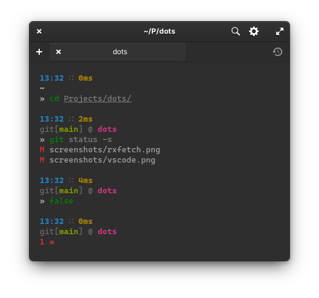
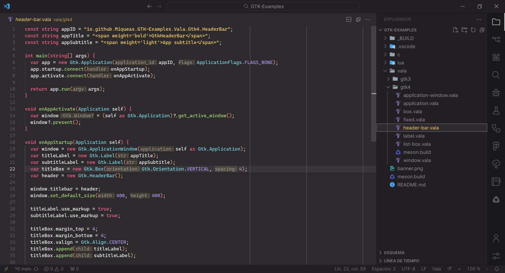

  <h1>dots</h1>
  <h3>Welcome to my dotfiles repository</h3>

System details:

  * __Distro__: Arch
  * __DE__: XFCE
  * __WM__: XFWM
  * __Theme__: Qogir Dark
  * __Icons__: Qogir Dark
  * __Cursor__: Qogir Dark
  * __Font__: Cantarell (10pt)
  * __Monospace Font__: [Caskaydia Cove Nerd Font](https://archlinux.org/packages/community/any/otf-cascadia-code-nerd/) (10pt)
  * __Terminal__: [Black Box](https://flathub.org/apps/details/com.raggesilver.BlackBox)
  * __Terminal Theme__: One Dark
  * __VS Code Theme__: [Github Dark](https://marketplace.visualstudio.com/items?itemName=GitHub.github-vscode-theme)

Wallpaper from [Unsplash](https://unsplash.com/es/fotos/Nhx2IVkw22s), credits to the author.

### Black Box

### Rxfetch

> NOTE: this is a custom version (a port to fish) of [rxfetch](https://github.com/Mangeshrex/rxfetch), all credits of the original code to the [author](https://github.com/Mangeshrex)

### VS Code

